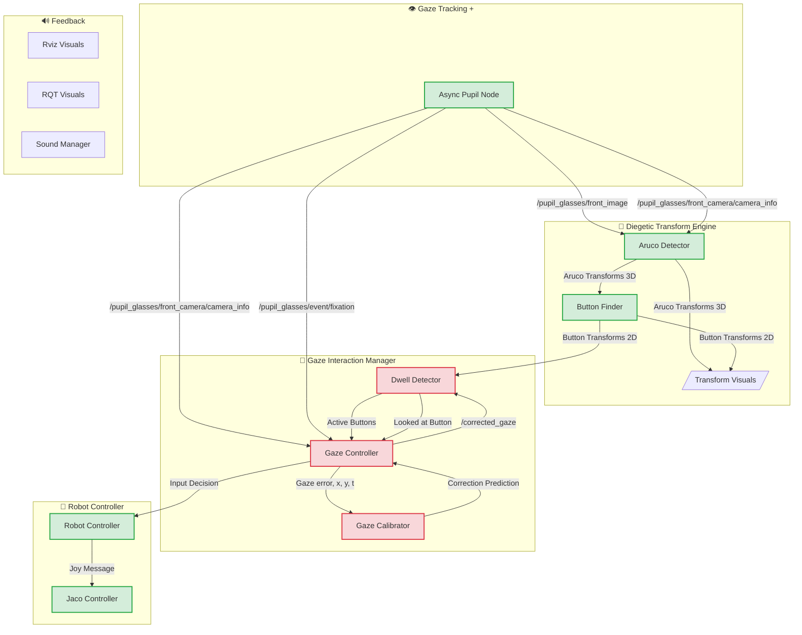

# RE+DO

New structure:

- [x] Plan



- [ ] Migrate to Kaiju

## pupil_glasses_node

- [x] Sends decoupled gaze and image at different frequencies
- [x] Sends also sensor information
- [x] Send camera calibration info
- [x] Sends new messages on smooth pursuit and expanded gaze properties

## aruco_detector_node

- [x] Detect ArUco markers in scene image. Classify as fixed, robot-mounted, transient as per config file. Check if there is a package?
- [x] TF frames (aruco*marker*\*), /marker_detections (MarkerDetectionArray.msg)
- [x] MarkerArray

## button_manager_node

- [x] At start, defines fixed button transforms at the beggining from csv / config file. TF (button*candidate*\*), /button_candidates (ButtonArray.msg)
- [x] Aggregates multiple TFs to find fused pose TF (button*fused*\*), /fused_buttons (ButtonArray.msg)
- [ ] 3D Visualization node, color depending on dwell time

## dwell_interaction_node

- [x] Map gaze to button hit tests, apply dwell-time filter, publish events.
- [x] New Launch file with all components

## recalibration_manager_node

- [ ] Subscribe to dwell events and smooth pursuit.
- [ ] **IMPORTANT:** Plot activation and blocks for start / end events in RQT
  - [ ] Visualizer to plot data to rqt? Do from controller instead
- [ ] Analyze gaze drift from events, publish recalibration offsets (call service)

## sound_feedback_node

- [] Subscribe to multiple events, play sounds for feedback.

robot_controller_node

- Keep the joy node

## Project:

diegetic_V3

pupil_neon_pkg -> pupil_neon_glasses
pupil_publisher.py
emulator_publisher.py
aruco_detector
aruco_detector.py (potentially integrate above?)

diegetic_button
button_locator.py
dwell_time_manager.py
smooth_pursuit_recalibration.py

sound_manager
sound_feedback.py

## TF tree

world
├── fixed markers (environment anchors)
│ ├── aruco*marker_1
│ │ ├── button_candidate_1a
│ │ └── button_candidate_1b
│ └── aruco_marker_2
│ └── button_candidate_2a
├── robot_base_link
│ ├── robot_arm_link_1
│ └── aruco_marker_robot_7
│ ├── button_candidate_r7a
│ └── button_candidate_r7b
└── button_fused*\* (dynamic, aggregated positions)
└── odom
└── pupil_glasses_neon
├── pupil_glasses_neon_front_camera
├── imu_link (?)
├── gaze_point
└── aruco_transient_88
└── button_candidate_r7b

Use other fiducial systems

apriltag_ros
ros2_aruco (proper)
stag_ros

### Recording

```bash
ros2 bag record -o subset /button_transforms /diegetic/inputs /fiducial_transforms /j2n6s300_driver/out/cartesian_command /j2n6s300_driver/out/finger_position /j2n6s300_driver/out/joint_angles /j2n6s300_driver/out/joint_state /j2n6s300_driver/out/joint_torques /j2n6s300_driver/out/tool_pose /j2n6s300_driver/out/tool_wrench /joy /pupil_glasses/gaze_position
```
