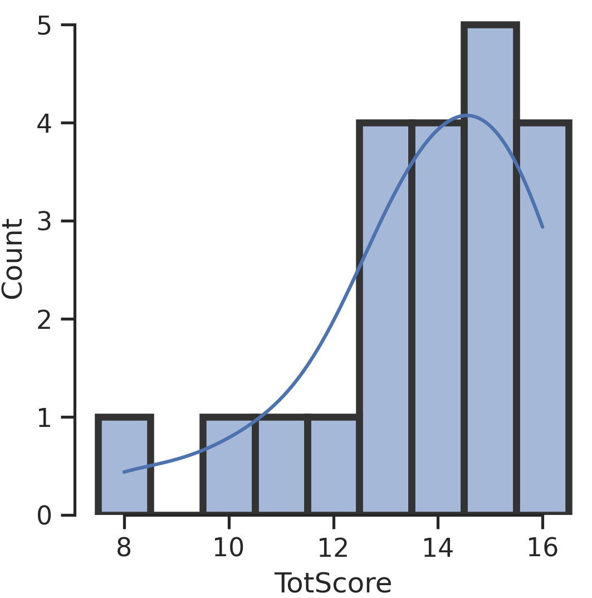
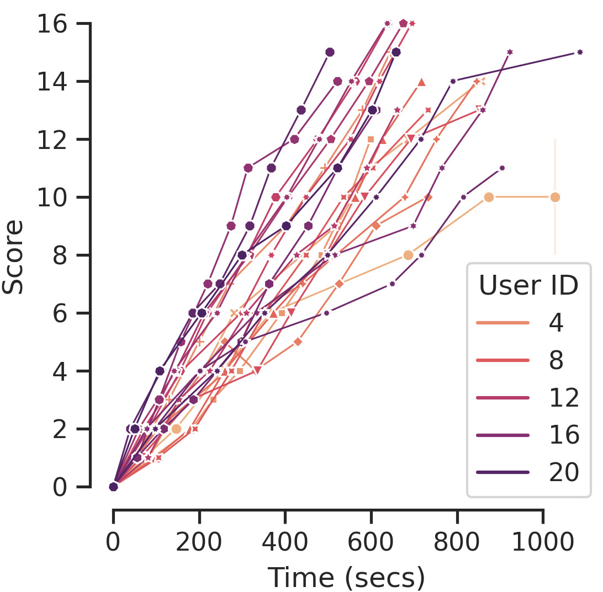
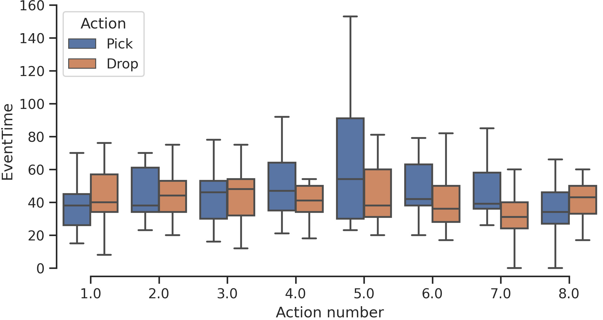
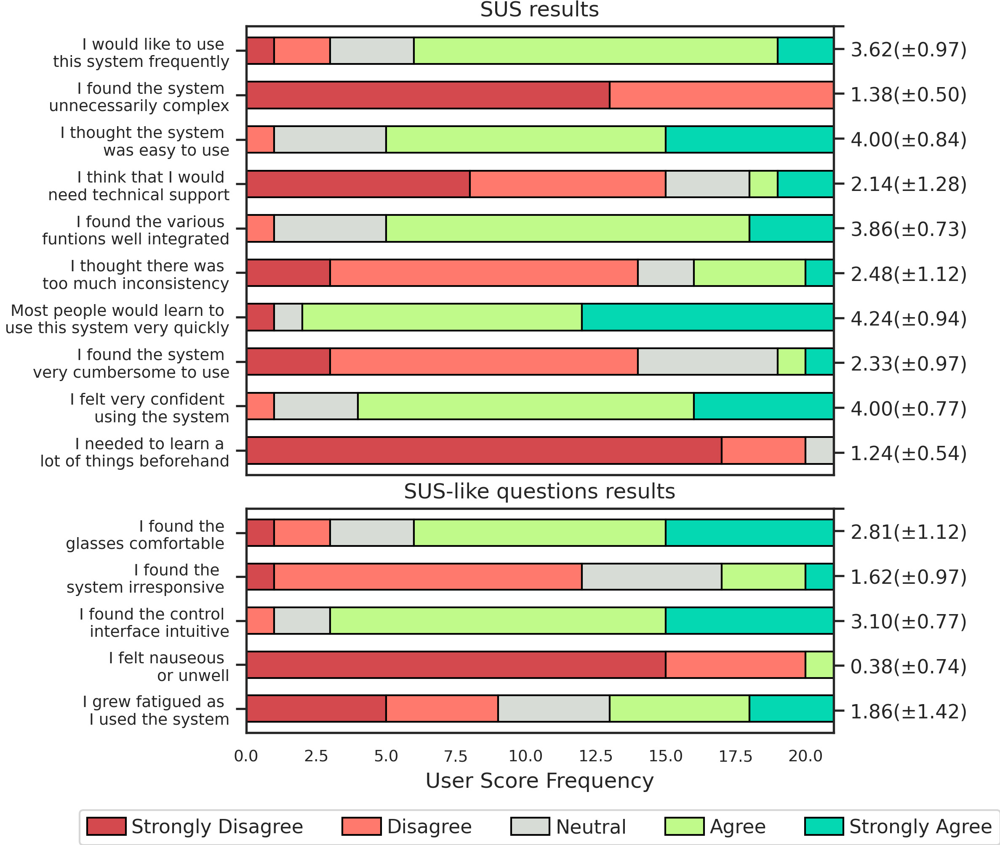
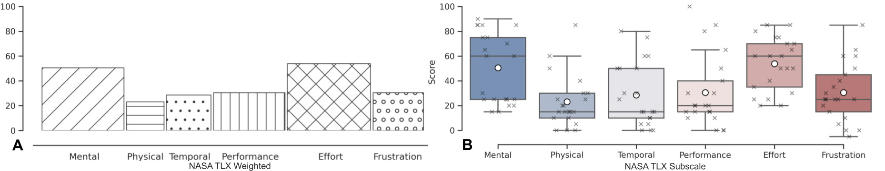

# Results

## YCB Block Pick and Place Protocol

Score information is summarized in Figure 1. The mean score was 13.71 (± 2.10) points, with an execution time for the whole protocol of 739.10 (± 156.52) seconds, or 12 minutes 19.10 seconds (± 2 minutes 36.52 seconds). The score distribution is shown in Figure 1a, with the complete benchmark available in the Supplemental Material. Scores were not normally distributed (p-value = 0.015 < 0.05).

 

**Figure 1**: 
(a) Score Distribution for YCB Block Pick and Place Protocol.
(b) Score evolution for each user with time. Slope corresponds to points per time measure.
(c) Duration of each of the eight pick and drop actions. The whisker reflects the extrema and each box tick the 25th percentile, median, and 75th percentile.

Actions were classified and split into pick-up and drop-off for each block (Figure 1c). On average, pick-up took 44.55 (± 23.24) seconds, and drop-off took 48.55 (± 28.56) seconds. The fifth pick action was slower due to participants moving the robot arm across the template. Cubes farther from users were typically picked last. Figure 1b shows participants took an average of 69.61 (± 1.78) seconds to score a point, with no noticeable change in score rate over time (Linear regression \(R^2 = 0.909, MSE = 1.96\); quadratic regression \(R^2 = 0.910, MSE = 1.95\)).

## System Usability Scale

Figure 2 shows results for each item of the System Usability Scale test (mean score of 75.36 (± 13.26)) and additional SUS-like questions. Most participants found the system intuitive, with two neutral and one disagreeing. Participants learned the system with minimal instruction and time, with over 80% agreeing the system had low complexity (Q2), was quick to learn (Q7), they felt confident using it (Q9), and needed to learn few things beforehand (Q10).

For additional Likert questions, the interface was intuitive, and the majority found the glasses comfortable. One participant reported nausea after the experiment (Q14), with five reporting fatigue (Q15) and three feeling very fatigued, matching comments on eye strain.

**Figure 2**: Frequency of results for the System Usability Scale (SUS Q1 to Q10 in order) and our SUS-like questions. Averages and standard deviation are shown on the right side. For the SUS, odd-numbered questions refer to positive sentiment, even-numbered ones are negative.

## NASA Task Load Index

The average NASA-TLX total workload score was 44.76 (± 18.77), with an average unweighted/raw score of 36.15 (± 12.72). Figure 3 shows the NASA-TLX subjective workload score distribution for each category. Mental demand (50.48) and effort (53.81) were the highest contributors, while physical (23.10) and temporal (28.57) demand were the smallest.

Spearman correlation test showed a positive relationship between the YCB score and perceived system usability scale (spearman-r 0.544, p-value = 0.011 < 0.05), and an inverse relationship between the usability scale and workload index (spearman-r -0.583, p-value = 0.006 < 0.05). No significant correlation was found between the YCB score and workload index (Spearman-r -0.381, p-value = 0.088).

**Figure 3**: NASA-TLX results for each category showing (A) Distribution plots for unweighted scores, where box shows the interquartile range and whiskers show the rest of the distribution excluding outliers \cite{Waskom2021}. (B) Mean weighted scores. The width corresponds to the weight reported by the users.

## System

### System Performance Summary

Table 1: Cumulative latency times for our gaze-interaction implementation execution
  
| **Process**             | **Latency (ms)**          |
|-------------------------|---------------------------|
| tobii_glasses.py        | 12 (± 4.64)              |
| ArUco_detect.py         | 23 (± 11.28)             |
| diegetic_buttons.py     | 26 (± 13.07)             |
| input_check.py          | 28 (± 13.99)             |
| **joy.py (Final total)**    | **30 (± 14.17)**         |

- **Frequency:** System performance was sampled over one minute of user-controlled activity, with the controller operating at **49.401 (± 0.007) Hz**.  
- **Bandwidth:** Data from the Tobii Pro Glasses 2 averaged **1.56 MB per message**, resulting in a bandwidth of **78 MB/sec**, primarily due to the front camera feed.  
- **Delay & Latency:** The processing pipeline takes **30 (± 14.17) ms** to complete, with detailed node latencies provided in **Table 1**. Communication with the Tobii Pro Glasses 2 showed an average latency of **11.96 (± 23.91) ms**, occasionally exceeding **200 ms** based on proximity to the host machine.  
- **Total:** Wireless communication between the eye-tracker and the system is identified as the primary bottleneck, with future iterations considering **tethered connections** to improve performance.  

